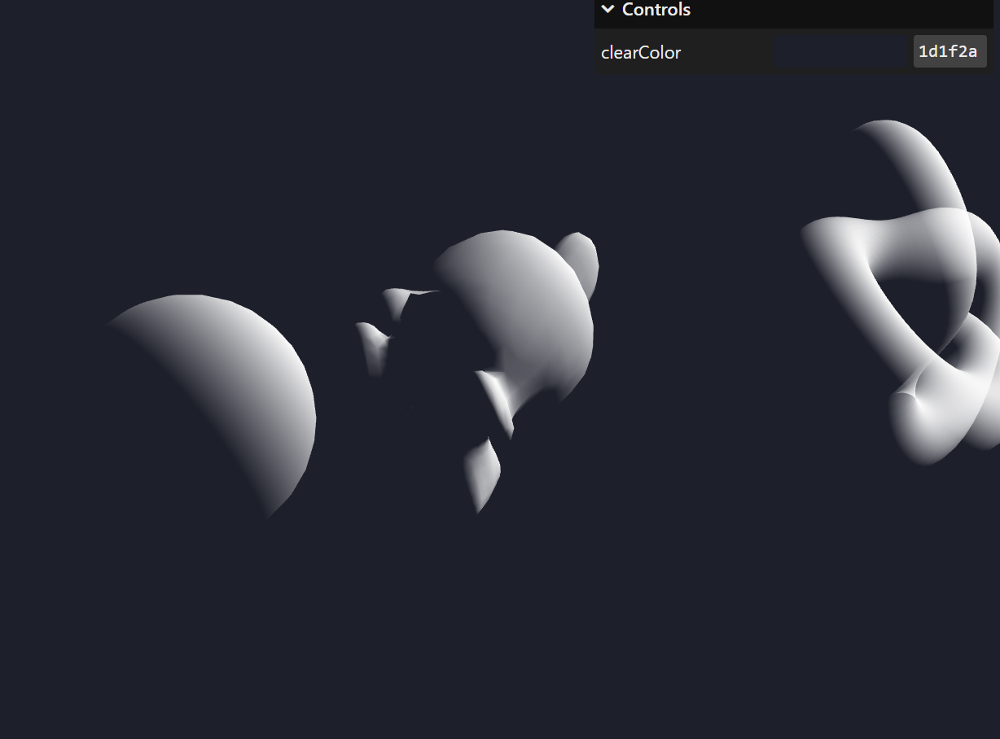

// Moon Effect

varying vec3 vPosition;
varying vec3 vNormal;

uniform float uTime;

void main()
{

// Stripes
float stripes = mod((vPosition.y - uTime _ 0.02) _ 20.0, 1.0);
stripes = pow(stripes, 3.0);

// Fresnel
vec3 viewDirection = normalize(vPosition - cameraPosition);
float fresnel = dot(viewDirection, vNormal);

// Final Color
gl_FragColor = vec4(1.0,1.0,1.0, fresnel);
#include <tonemapping_fragment>
#include <colorspace_fragment>
}

---

float remap(float value, float originMin, float originMax, float destinationMin, float destinationMax)
{
return destinationMin + (value - originMin) \* (destinationMax - destinationMin) / (originMax - originMin);
}

---
